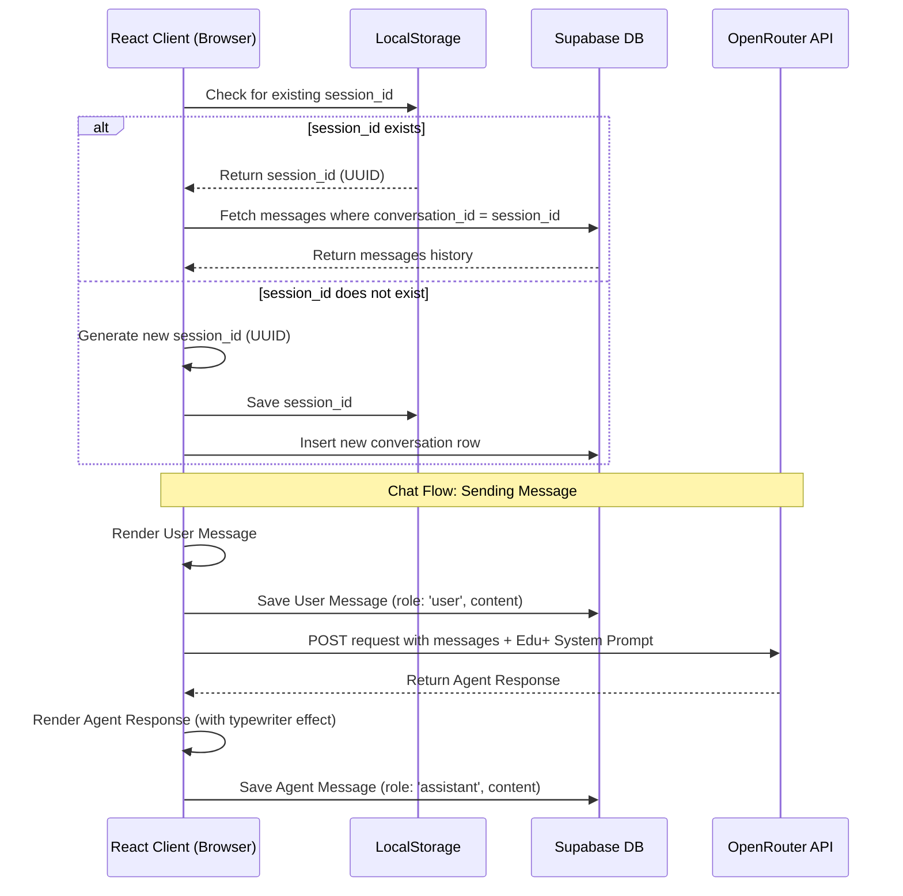

# Design Spec: AI Chat Agent Integration

Integrate a smart, cybernetic-themed AI Chat Agent into the Edu+ platform to guide visitors, answer program/services questions, and offer career advisory.

## 1. Goals & User Experience

- **Interactive Advisor**: Act as a site guide (explaining programs like FuturePath Navigator, LifeSkills Lab, etc.) and a career/academic mentor.
- **Dual-Edge Layout**:
  - The AI Agent floating widget is positioned at `fixed bottom-8 right-8` (always visible).
  - The "Go to Top" button is moved to the bottom-left (`fixed bottom-8 left-8`) to prevent layout clutter.
- **Cybernetic Theme**: Implements shadcn styling with strict straight lines (`rounded-none`), dark backgrounds (`#0B0F14`), and neon cyan accents (`#7DF9FF`).
- **Telemetry Console Look**: The chat window has a terminal-like appearance, including system status indicators, green/cyan styling, and custom status indicators.

---

## 2. Architecture & Data Flow

### Chat Session & Message Synchronization
We maintain a persistent session by generating a session ID (UUID) and storing it in `localStorage`. 



---

## 3. Database Schema

We will execute the following DDL in Supabase:

```sql
create extension if not exists "uuid-ossp";

-- Conversations Table
create table if not exists public.conversations (
    id uuid primary key default gen_random_uuid(),
    created_at timestamp with time zone default timezone('utc'::text, now()) not null,
    updated_at timestamp with time zone default timezone('utc'::text, now()) not null
);

-- Messages Table
create table if not exists public.messages (
    id uuid primary key default gen_random_uuid(),
    conversation_id uuid references public.conversations(id) on delete cascade not null,
    role text check (role in ('user', 'assistant', 'system')) not null,
    content text not null,
    created_at timestamp with time zone default timezone('utc'::text, now()) not null
);

-- Indexes
create index if not exists messages_conversation_id_idx on public.messages(conversation_id);

-- Enable RLS & Policies
alter table public.conversations enable row level security;
alter table public.messages enable row level security;

create policy "Allow public insert for conversations" on public.conversations for insert with check (true);
create policy "Allow public select for conversations" on public.conversations for select using (true);
create policy "Allow public insert for messages" on public.messages for insert with check (true);
create policy "Allow public select for messages" on public.messages for select using (true);
```

---

## 4. API Integration & Security

### OpenRouter & Gemini Models
- We will call OpenRouter using the URL `https://openrouter.ai/api/v1/chat/completions`.
- We will default to `google/gemini-2.5-flash` or `google/gemini-2.0-flash-lite:free` as a fallback.
- The system prompt will be loaded with full Edu+ context, including the 6 execution programs, council biographies (e.g. Bikash Oinam, Roshan Khumukcham, Ronen Akoijam), and contacts.

### Client-Side Environment Variable Exposing
Since we do not have a dedicated backend server in this Vite application, we will expose the `OPENROUTER_API` key client-side by updating `vite.config.ts` to define it from the environment:
```typescript
define: {
  'process.env.OPENROUTER_API': JSON.stringify(process.env.OPENROUTER_API || env.OPENROUTER_API),
}
```

---

## 5. Component Layout & Verification Plan

### Proposed File Structure
1. **[NEW]** `src/lib/supabaseClient.ts`: Initializes the Supabase client.
2. **[NEW]** `src/lib/openRouter.ts`: Handles communication with OpenRouter API.
3. **[NEW]** `src/components/AIChatAgent.tsx`: The primary chat floating action button, chat container, and client-side logic.
4. **[MODIFY]** `src/components/ScrollToTop.tsx`: Relocated from `bottom-8 right-8` to `bottom-8 left-8`.
5. **[MODIFY]** `src/App.tsx`: Incorporate `<AIChatAgent />` in the root layout.
6. **[MODIFY]** `vite.config.ts`: Define environment variable replacements.

### Verification Plan
- **Verification of Database Logging**: Confirm rows are successfully inserted in Supabase `conversations` and `messages` tables when starting a chat.
- **Verification of History Persistence**: Refresh page and check that conversation history is fully restored from Supabase.
- **Verification of Agent Responses**: Verify OpenRouter replies correctly and references local Edu+ information (e.g. specific mentors, future-ready programs).
- **Visual Check**: Ensure layout alignment is correct, with no overlapping elements, and adhering to `rounded-none`.
