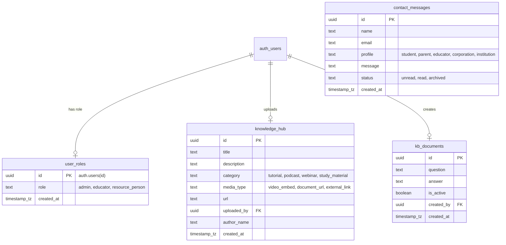
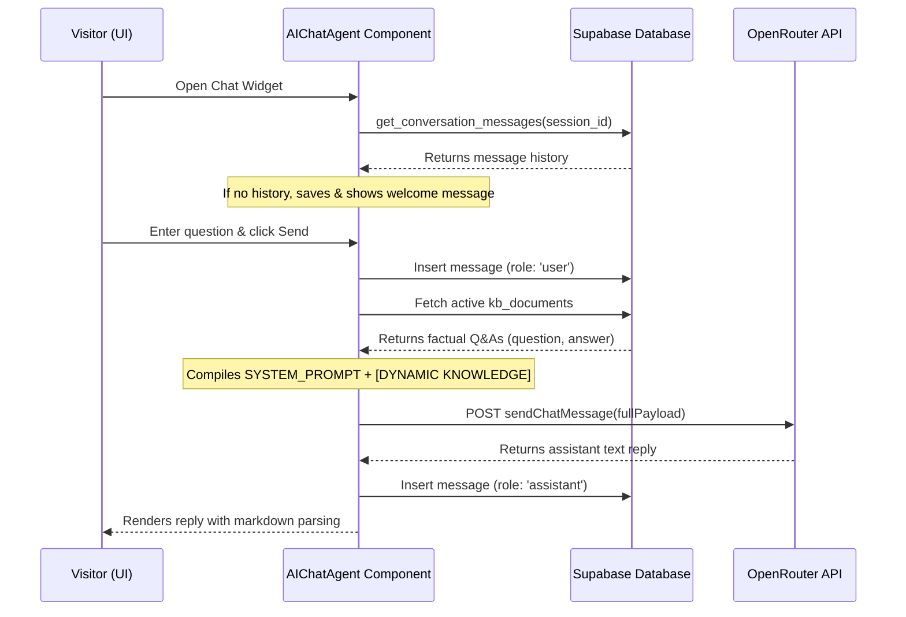

# Edu+ Ecosystem System Documentation

Welcome to the comprehensive system documentation for **Edu+ Skills**, a next-generation learning and career acceleration platform. This document outlines the system architecture, database structure, tech stack, design guidelines, page routing, user flows, and the mechanics of the AI cognitive chat advisor.

---

## 1. Executive Project Summary

**Edu+ Skills** is an innovation-led, hybrid (online and offline) platform that bridges classrooms and the real world. It supports learners across their entire educational lifecycle—from school stream selection and life skills to college admissions prep, industry mentorship, job placement, and educator training.

The codebase is structured under `C:\edu-plus\app-v2`, utilizing a futuristic, high-tech, HUD-style user interface built for premium visuals and structured data display.

---

## 2. Tech Stack Overview

The application is built using a modern, performant, and scale-ready technological stack:

| Component / Layer | Technology | Key Details |
| :--- | :--- | :--- |
| **Frontend Framework** | React 19 | Standardized on functional components, hooks, and clean lifecycle management. |
| **Language** | TypeScript 5 | Full static typing, typed props, and robust interface definitions. |
| **Build & Dev Tooling** | Vite 7 | Lightning-fast HMR dev server and optimized production bundles. |
| **Styling Framework** | Tailwind CSS v3.4.19 | Utility-first styling configured with custom design tokens. |
| **UI Components** | Radix UI + Shadcn UI | Straight-edged, accessible, unstyled primitives styled with custom classes. |
| **Routing** | React Router v7 | Declarative React routing with protected route middleware. |
| **Database & Backend** | Supabase | PostgreSQL backend, built-in Auth, database API client, and real-time pub/sub channels. |
| **AI LLM Gateway** | OpenRouter API | Integrated with the `google/gemini-2.5-flash` model for intelligent counseling. |
| **Data Visualizations** | Recharts v3.8 | Responsive SVG charts (Area, Cartesian Grid) for telemetry dashboards. |
| **Visual Elements** | Lucide React + Hugeicons | Custom vector icon libraries matching visual sections. |
| **Helper Utilities** | `dotted-map`, `clsx`, `tailwind-merge` | Geographic dot mapping, conditional class joining, and Tailwind rule merging. |

---

## 3. Design System & Style Guide — Nordic Lagom Philosophy

The Edu+ visual identity follows the **Nordic Lagom** (Swedish for "just the right amount") design philosophy: clean, balanced, and quietly confident. The system uses warm neutrals, a dark-first palette with light mode support, and a restrained amber/gold accent. The aesthetic avoids flashy effects in favor of refined transitions, precise spacing, and serene composition.

### A. Color Palette (OKLCH)

All color tokens are defined in `src/index.css` using the OKLCH color space.

**Light Mode (`:root`)**
| Token | OKLCH Value | Description |
|---|---|---|
| `--background` | `98.5% 0.004 80deg` | Warm off-white cream |
| `--foreground` | `22% 0.01 60deg` | Warm dark charcoal |
| `--primary` | `75% 0.12 70deg` | Warm amber/gold accent |
| `--muted-foreground` | `55% 0.015 60deg` | Warm slate grey (secondary text) |
| `--border` | `90% 0.008 80deg` | Soft warm stone border |
| `--card` | `97% 0.004 80deg` | Slightly off-white card surface |

**Dark Mode (`.dark`)**
| Token | OKLCH Value | Description |
|---|---|---|
| `--background` | `18% 0.012 60deg` | Warm charcoal (not cold black) |
| `--foreground` | `93% 0.006 80deg` | Warm off-white text |
| `--primary` | `78% 0.13 70deg` | Candlelight amber accent |
| `--muted-foreground` | `65% 0.012 60deg` | Desaturated warm slate |
| `--border` | `100% 0 0deg / 0.08` | Subtle white-alpha border |
| `--card` | `22% 0.012 60deg` | Elevated warm charcoal surface |

### B. Typography
- **Headings (`h1`–`h6`):** `Inter Variable` (sans-serif) — clean, geometric, and modern.
- **Body Content & UI Text:** `Inter Variable` or `Outfit` (sans-serif) — high readability across device sizes.
- **Monospace is reserved** only for technical data displays (e.g., IDs, status codes). It must not be used for headlines, navigation, or body copy.

### C. The Straight-Edge Rule
- **No Curved Lines:** All container blocks, cards, buttons, inputs, badges, dialogs, navigation links, borders, SVG paths, and chart interpolations must use **straight lines only**.
- **No rounded corners:** Developers must enforce the `rounded-none` class (or omit any `rounded-*` classes entirely).
- **SVG paths:** Must use `L` (line to), `H` (horizontal), `V` (vertical), or `Z` (close). Bezier curves (`C`, `S`, `Q`, `A`) are forbidden.
- **Charts:** Recharts components must use `type="linear"`. Values `type="monotone"` and `type="natural"` are forbidden.
- **Exceptions:** Third-party assets are wrapped or isolated and accompanied by a `/* ui-ignore */` comment.

### D. Animation Philosophy
- **Allowed:** Refined transitions — fade-ins, soft translations (`translateY`), hover color shifts, and smooth opacity changes.
- **Forbidden:** Glowing effects, pulsing neon, scrambling/typewriter text effects, cyberpunk HUD animations, or any motion that feels aggressive or flashy.

### E. Illustration & Imagery Guidelines
- **Style:** Ultra-clean flat vector illustration with soft gradient cel shading, warm dark charcoal backgrounds, candlelight amber highlights, and smooth matte color gradients.
- **Asian Community Requirement:** All human characters depicted in illustrations and avatars **must** represent East Asian people. Non-Asian characters are strictly forbidden.
- **Geometry:** Straight lines only in illustrations. No curved decorative paths.

---

## 4. System Architecture & Folder Structure

The project directory is laid out cleanly to isolate business logic, UI rendering, routing, and data handling:

```
app-v2/
├── public/                 # Static assets (images, avatars, logos)
├── scripts/                # Utility scripts (e.g., UI compliance checker, SQL migrations)
├── src/
│   ├── components/         # Reusable UI widgets and layout modules
│   │   ├── ui/             # Shadcn-generated components (Button, Input, Dialog, etc.)
│   │   ├── effects/        # Custom animations (ImmersiveHero, TypeScramble, Spotlight)
│   │   ├── magicui/        # Scrolling Marquee wrapper
│   │   └── svgs/           # SVG icons for third-party integrations
│   ├── hooks/              # Custom React state hooks
│   ├── lib/                # Context providers, Supabase clients, API services
│   │   ├── AuthContext.tsx # Authentication state and mock session swapper
│   │   ├── openRouter.ts   # Chat agent API helper
│   │   └── supabaseClient.ts # Supabase client initialization
│   ├── pages/              # Route-level page layouts (Home, About, Council, etc.)
│   ├── sections/           # Global sections (Navigation, Footer, Hero)
│   ├── App.tsx             # Main routing registry
│   ├── index.css           # Core styling tokens, imports, keyframe animations
│   └── main.tsx            # React application mounting file
```

---

## 5. Database Schema & Policies

The database is built on PostgreSQL inside Supabase, featuring Row Level Security (RLS) policies to secure data streams. The schema is organized into four main tables:



### Table Definitions & RLS Policies:

#### 1. `public.user_roles`
Tracks administrative and staff clearance levels.
- **Schema:**
  - `id uuid PRIMARY KEY REFERENCES auth.users(id) ON DELETE CASCADE`
  - `role text NOT NULL CHECK (role IN ('admin', 'educator', 'resource_person'))`
  - `created_at timestamp with time zone DEFAULT now()`
- **Policies:**
  - *Public Read:* Allowed for select requests (`Allow public read access to roles`).
  - *Admin Full Control:* Allowed only if the authenticated user has the `'admin'` role (`Allow admin to manage roles`).

#### 2. `public.knowledge_hub`
Stores resource items accessible via the public Knowledge Hub.
- **Schema:**
  - `id uuid PRIMARY KEY DEFAULT gen_random_uuid()`
  - `title text NOT NULL`
  - `description text`
  - `category text NOT NULL CHECK (category IN ('tutorial', 'podcast', 'webinar', 'study_material'))`
  - `media_type text NOT NULL CHECK (media_type IN ('video_embed', 'document_url', 'external_link'))`
  - `url text NOT NULL`
  - `uploaded_by uuid REFERENCES auth.users(id) ON DELETE SET NULL`
  - `author_name text NOT NULL`
  - `created_at timestamp with time zone DEFAULT now()`
- **Policies:**
  - *Public Read:* Anonymous read access allowed (`Allow public read access to knowledge content`).
  - *Staff Write:* Insert/Update/Delete allowed if the user is an `'admin'`, `'educator'`, or `'resource_person'` (`Allow authenticated staff to manage knowledge content`).

#### 3. `public.kb_documents`
Houses dynamic knowledge injected into the AI Cognitive Advisor.
- **Schema:**
  - `id uuid PRIMARY KEY DEFAULT gen_random_uuid()`
  - `question text NOT NULL`
  - `answer text NOT NULL`
  - `is_active boolean DEFAULT true`
  - `created_by uuid REFERENCES auth.users(id) ON DELETE SET NULL`
  - `created_at timestamp with time zone DEFAULT now()`
- **Policies:**
  - *Public Read:* Allowed for selectors (`Allow public read access to kb`).
  - *Staff Write:* Restricted to `'admin'` or `'educator'` accounts (`Allow staff to manage kb documents`).

#### 4. `public.contact_messages`
Logs contact and inquiry submissions.
- **Schema:**
  - `id uuid PRIMARY KEY DEFAULT gen_random_uuid()`
  - `name text NOT NULL`
  - `email text NOT NULL`
  - `profile text NOT NULL`
  - `message text NOT NULL`
  - `status text DEFAULT 'unread' NOT NULL CHECK (status IN ('unread', 'read', 'archived'))`
  - `created_at timestamp with time zone DEFAULT now()`
- **Policies:**
  - *Public Insert:* Anyone can submit contact requests (`Allow public insert contact messages`).
  - *Staff Access:* Select/Update/Delete limited to `'admin'` and `'educator'` roles (`Allow staff to read/update contact messages`).

---

## 6. Page Layouts & Component Directory

The routing registry inside `src/App.tsx` maps eleven distinct view page URLs:

### 1. Home Page (`/`)
The main landing page designed with an immersive background loop video (`/assets/hero-bg-new.mp4`), structured overlays, and the following sections:
- **Hero:** Main branding layout showcasing the tagline *"Elevate Tomorrow"* alongside platform statistics.
- **PartnerMarquee:** Infinite scrolling brand loop containing names of collaborating corporate, academic, and research organizations.
- **TelemetryStats:** An interactive statistics panel showing global learner timezone reach (dotted SVG map using `dotted-map`), simulated chat modules, and key platform milestones.
- **Vision:** An interactive text reveal panel displaying the core mission and values of the platform.
- **PathwaySimulator (Integrations):** A grid displaying external platform connections (OpenAI, GitHub, Zoom, LinkedIn, etc.) that sync learner progress.
- **ServicesMatrix:** A radial-masked infinite marquee displaying the 6 flagship programs floating around a central branding node.
- **PedigreeShowcase:** Clean, straight-edged grid detailing strategic integrations, standards compliance, and advisory network scales.

### 2. About Page (`/about`)
Narrates the historical journey of the platform through an interactive timeline structure:
- **Chapter 1 // The Roots:** Genesis at grassroot levels in Manipur.
- **Chapter 2 // The Hub Model:** Distributed nodes connecting Manipur, Kolkata, Delhi, and Singapore.
- **Chapter 3 // Core Pillars:** Clarity of direction, access to opportunities, and career-aligned skills.
- **Chapter 4 // Foundations:** Pedigree summary detailing multi-domain expertise.

### 3. Programs Page (`/programs`)
Details the six core modular phases of the Edu+ skills catalog. Selecting a phase updates the active MagicCard view with visual layouts and outcomes:
1. **FuturePath Navigator:** Scientific psychometrics, DMIT assessments, and stream selection.
2. **LifeSkills Lab:** Adaptability, verbal/written speech, financial, and digital literacy.
3. **Expert Connect Live:** Interactive mentorship matching and industry expert talks.
4. **Global Admissions Studio:** Entrance exam preparation (JEE, NEET) and overseas applications.
5. **Career Launchpad:** Profile design, mock HR/technical interviews, and placements.
6. **Innovation Studio & Educator Academy:** STEM spaces, alpha project incubation, and teacher coaching.

### 4. Signature Experiences Page (`/events`)
Highlights annual high-energy educational programs:
- **Winter Camp:** A 5-7 day STEM/robotics and adventure camp for Middle and High schoolers.
- **Summer Camp:** A 2-3 week academic, leadership, and college-profile bootcamp for Higher Secondary cohorts.
- **Education Fair:** An annual student expo matching applicants with global university panels.
- **FAQ Section:** An accordion interface answering parent questions regarding accommodation, fees, and safety rules.

### 5. Expert Council Page (`/council`)
Showcases the credentials of the 14 advisory council members:
- **Boardroom Seating Chart:** An interactive virtual grid. Selecting an advisor seat opens a detailed dossier modal with biography details, locations, and research categories.
- **Committees List:** Lists members categorized into their respective panels.
- **Institutional Linkages Illustration:** Visual partner diagram connecting agencies (e.g., Singapore MOE, South Korea Energy Labs, Goonj).

### 6. One-to-One Guidance Page (`/guidance`)
Explains personalized counseling options:
- **Stakeholder Tabs:** Custom pathways tailored for Students, Parents, Job Seekers, and Teachers.
- **Interactive Command Terminal:** A retro terminal console simulating command logs (e.g., `./futurepath-navigator.sh --assess`) that print live text streams for the selected stakeholder.

### 7. News & Insights Page (`/news`)
Displays editorial focus columns (Grassroots, Research, Readiness) alongside a grid of recent articles with metadata, excerpt summaries, and read times.

### 8. Contact Page (`/contact`)
Handles stakeholder communication:
- Displays physical base information (Mommy Complex, Nambol Bazar, Manipur) and hotlines.
- Includes a contact form syncing submissions directly to Supabase (`contact_messages` table).
- Includes a newsletter subscription form.

### 9. Login Page (`/login`)
Staff portal access:
- Autocomplete-enabled secure fields for email and password.
- View/hide password toggle.
- Automatically handles redirects upon detecting an authenticated session.

### 10. Dashboard Page (`/dashboard`)
An administrative terminal for managers and trainers containing four tabs:
- **Overview Telemetry:** Visual indicators of hub nodes, active fact matrices, and an interactive Area Chart showing desktop vs. mobile traffic metrics.
- **Content Upload Station:** Form to append tutorial videos, podcasts, and study materials into the database.
- **AI Cognitive Training Matrix:** Form to inject new factual answers directly into the site advisor bot, with list buttons to toggle fact status.
- **Message Hub:** Renders user inquiries received from the public contact page, with status toggles to mark messages read.
- **Dev Clearance swapper:** A floating debugging panel allowing testing of different user roles (`admin`, `educator`, `resource_person`) in simulated mode.

---

## 7. AI Cognitive Chat Advisor System

The AI chatbot support (`AIChatAgent.tsx`) floats on public-facing pages, guiding users through site services and careers.



### Key Technical Operations:
1. **Session Handling:** Checks local storage for `edu_plus_chat_session_id`. If empty, creates a new UUID and initializes the conversation in the database via the RPC database function `ensure_conversation`.
2. **Dynamic Knowledge Injection:** Before prompting, it queries `kb_documents` where `is_active = true`. It appends these Q&A pairs (e.g. *"Topic: Founder Bikash Oinam Email -> Fact: bikash@eduplus.in"*) directly into the system prompt context. This allows staff to update the bot's knowledge in real-time from the dashboard without redeploying code.
3. **OpenRouter API Integration:** Submits the message history to OpenRouter using the `google/gemini-2.5-flash` model, ensuring structured responses.
4. **Rich Content Formatting:** Parses output text to render lists, bold text (`**`), bullet points (`* `), and numbered sequences using custom styled wrappers.

---

## 8. Core User Flows

### Flow A: Public Visitor Exploration
1. **Landing:** Visitor lands on `/`, views telemetry stats, and clicks *"Start Your Pathway"*.
2. **Programs:** Learns about the 6 educational phases.
3. **Advisory Council:** Inspects dossiers on `/council` using the boardroom seating chart.
4. **Counseling Info:** Reviews stakeholder options on `/guidance`, viewing simulated test logs.
5. **Inquiry:** Visitor fills out the form on `/contact` with their profile (e.g. "Parent"). The submission is saved to `contact_messages`.

### Flow B: Staff Content Management
1. **Sign In:** Staff accesses `/login` and authenticates using their credentials.
2. **Telemetry Inspection:** Staff views active user traffic trends on the dashboard.
3. **Knowledge Base Ingestion:** Staff uploads a technical video link on the *Upload Station* tab, making it instantly available on `/knowledge-hub`.
4. **AI Training:** Staff adds a new fact on the *AI Training* tab, updating the chatbot's prompt immediately.
5. **Message Triaging:** Staff reviews incoming messages on the *Message Hub* tab and marks them as read. Real-time inserts trigger toast notifications.
